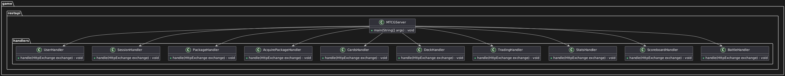
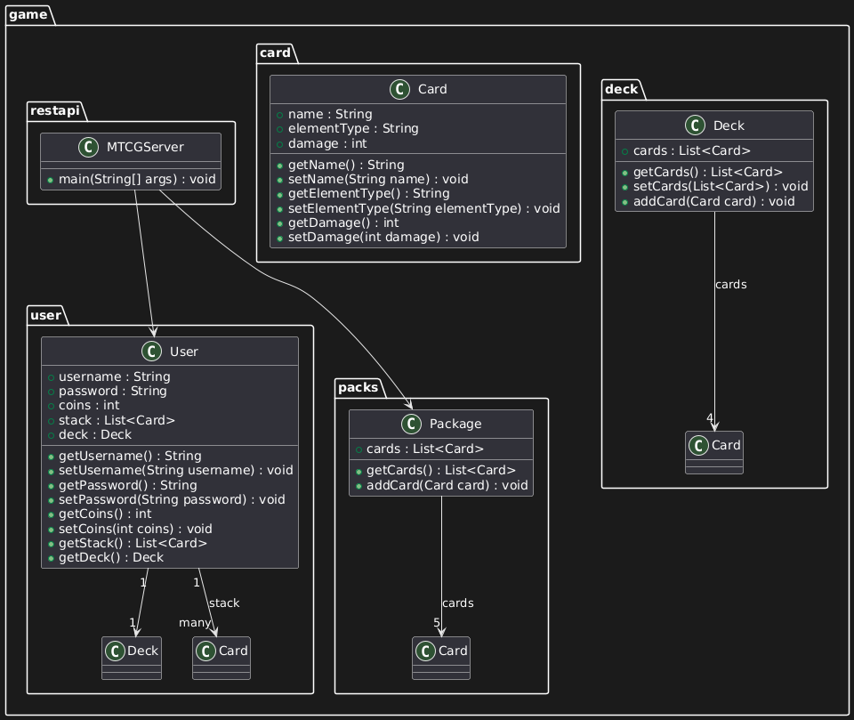

# MTCG Project Protocol

#### by Niklas Brandtner

## 1. Project Overview

This document describes the architectural decisions, structure, and class diagrams for the MTCG (Monster Trading Card Game) project.

## 2. Application Design

### 2.1 Architecture Overview

The MTCG application follows a RESTful architecture, with endpoints that allow user registration, login, package management, and transactions for acquiring packages. The server handles HTTP requests and responses, ensuring that all interactions between the client and the server follow the HTTP protocol.

The following key features have been implemented:
- A REST server that listens to incoming client requests.
- HTTP request parsing and routing functionality.
- User registration, login, and user state management.
- Token-based authentication for security.

### 2.2 Server Components

The server comprises several core components that handle specific routes:

- **UserHandler**: Handles user registration and creation of new users. (Right now new Users are being saved in a Hashmap because i havent fully set up the PostgreSQL Docker Container)
- **SessionHandler**: Manages user login and token generation for session management.
- **PackageHandler**: Responsible for adding new card packages to the server.
- **AcquirePackageHandler**: Handles transactions where users acquire a package using their coins.

### 2.3 Class Diagram

The following class diagram illustrates the relationships between the core classes in the application.

Class Diagram for the Handlers:

Class Diagram for the rest:

(it was too much to fit on one screenshot with the tool i used)
### 2.4 Key Classes

#### 2.4.1 `MTCGServer`
The `MTCGServer` is responsible for initializing and running the server, creating the various contexts for the different routes.

#### 2.4.2 `User`
The `User` class stores user-related information such as username, password, coins, stack (cards), and deck.

#### 2.4.3 `Card`
The `Card` class represents an individual trading card, with attributes such as name, element type, and damage.

#### 2.4.4 `Deck`
The `Deck` class represents a user's card deck, containing a list of exactly 4 cards.

#### 2.4.5 `Package`
The `Package` class represents a collection of cards that users can acquire. Each package contains exactly 5 cards.

## 3. Application Structure

The project is structured into multiple packages, each handling different aspects of the game logic:

- `game.restapi`: Contains the server and HTTP handlers for managing REST API routes.
- `game.user`: Contains the `User` class and manages user-related functionality.
- `game.card`: Contains the `Card` class that defines the properties of individual cards.
- `game.deck`: Contains the `Deck` class for managing a user's deck of cards.
- `game.packs`: Contains the `Package` class for handling card packages.

## 4. Design Decisions

### 4.1 REST API Design
The API was designed to be as simple and intuitive as possible, following RESTful principles. Each endpoint corresponds to a specific resource or action, such as user registration, login, or acquiring a package.

### 4.2 Token-based Authentication
For user session management, I implemented a token-based authentication system. After a successful login, the server generates a token in the format `username-mtcgToken`, which the client must use in subsequent requests to authenticate the user.

### 4.3 Error Handling
I followed standard HTTP status codes to handle errors:
- **400** for bad requests (e.g., malformed JSON or incorrect package size).
- **401** for unauthorized access (e.g., missing or invalid tokens).
- **409** for conflict (e.g., trying to register an already existing user).

## 5. Git Repository

The source code is available in the following GitHub repository:

[MTCG_Brandtner](https://github.com/nbrandtner/MTCG)